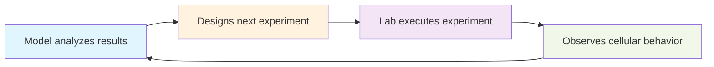

# Model: Machine Understanding of Cellular Life Discovery System

**Model** is the core component in an active learning discovery system that holds a representation of the sample. Traditionally, a model holds a sample representation, but in an active learning process, the model receives data from experiments, from which the representations have to be updated, and at the same time, generate hypotheses for new experiments. It is not understood how to do that. This project is a demonstration of that process.

## The Challenge

In traditional machine learning, models hold static representations learned from fixed datasets. However, in active learning for scientific discovery, the model must simultaneously:

1. **Update its internal representations** based on incoming experimental data
2. **Generate new experimental hypotheses** to test next

This dual requirement creates a fundamental challenge: how does a model maintain coherent representations while actively designing experiments that may contradict or extend those representations? The process of representation updating and experiment generation must be tightly coupled, yet their interaction is not well understood.

This project demonstrates one approach to this challenge through a multi-component architecture that explicitly separates and coordinates these functions.

## Active Learning Loop Architecture

The Model operates through a continuous feedback loop with laboratory automation systems:



### Demonstration: Representation Updating + Experiment Generation

This example illustrates how the Model simultaneously updates its internal representations and generates new experiments. The Model begins with initial representations about cellular behavior, then updates these based on experimental results while generating new hypotheses to test:

**Initial representation**: "Cell density may affect protein expression"
**Generated Sample_Spec** (to test this representation):
```json
{
  "cell_line": "HeLa",
  "passage_number": 12,
  "treatments": [{
    "name": "doxorubicin",
    "concentration": 1,
    "units": "µM",
    "duration": 6,
    "time_units": "hours"
  }],
  "imaging_parameters": {
    "channels": ["DAPI", "p53_Alexa488"],
    "time_lapse": {"interval": 300, "duration": 14400}
  }
}
```

**Experimental Results**: p53 levels increase with cell density
**Updated representation**: "Cell density affects p53 through contact inhibition pathway"
**New generated hypothesis**: "Contact inhibition mediates density-dependent p53 accumulation"

This demonstrates the core challenge: the Model must update its representation (from general "density affects expression" to specific "density affects p53 via contact inhibition") while simultaneously generating new experiments to test the updated representation. The coupling between representation updating and experiment generation is explicitly maintained throughout this process.

## Our Approach: Multi-Head Architecture

To address the representation-updating + experiment-generation challenge, we propose a multi-head neural network architecture that explicitly separates these functions while maintaining coordination between them. This architecture includes six specialized components:

- **Proposal Generation**: Generates testable hypotheses based on current experimental evidence
- **Methodology Planning**: Designs experimental protocols and optimizes resource allocation  
- **Falsification**: Creates adversarial experiments to test the robustness of established findings
- **Multi-Scale Integration**: Integrates phenomena across molecular, cellular, and population levels
- **Conceptual Framework**: Maintains theoretical coherence across discoveries
- **Context Management**: Maps the applicability boundaries of experimental findings

### Representation Updating Strategy
Our approach addresses the representation challenge through systematic validation and context-dependent knowledge structures. Established findings are continuously challenged with adversarial experiments, and only results that survive systematic refutation attempts are incorporated into the evolving knowledge base.

### Knowledge-Experiment Coupling
The architecture maintains explicit coupling between internal representations and experiment generation. As representations update based on new data, the experiment generation components receive updated context to inform future experimental designs. This coupling mechanism is a key demonstration of how to coordinate representation updating with active experimental design.

## Scientific Methodology

### Discovery Validation
- **Multi-Level Testing**: Validates findings across molecular, cellular, and population scales
- **Context Mapping**: Systematically explores the boundaries where discoveries hold true
- **Reproducibility**: Ensures discoveries are consistent across independent experiments
- **Falsification Resistance**: Only accepts discoveries that survive attempts to disprove them

### Output Formats
Model communicates discoveries through:
- **Natural language** explanations for human researchers
- **Mathematical models** with defined parameters and uncertainty bounds
- **Visual representations** showing relationships and processes
- **Structured protocols** for experimental replication

## Current Implementation Status

### ✅ Completed
- **Sample_Spec Schema**: Complete specification for experimental conditions ([sample_spec.md](sample_spec.md))
- **Conceptual Architecture**: Detailed system requirements and design
- **Data Structures**: JSON schemas for experiment specification and results

### 🚧 In Development
- **Model Architecture**: Multi-head neural network implementation
- **Laboratory Integration**: Interfaces for automated equipment control
- **Discovery Engine**: Core algorithms for hypothesis generation and testing

### 🔮 Future Development
- **Multi-Organism Systems**: Extend to tissue and organ-level phenomena
- **Temporal Dynamics**: Study evolutionary processes and biological rhythms
- **Cross-Disciplinary Integration**: Connect with computational chemistry and systems biology

## System Capabilities

The Model addresses several limitations in current experimental biology workflows:

1. **Automated hypothesis generation** based on comprehensive analysis of experimental data
2. **Experimental optimization** through systematic parameter exploration
3. **Context-dependent discovery** via systematic boundary condition testing
4. **Continuous experimentation** without manual intervention between experimental cycles

The system is designed to operate continuously, generating new experimental hypotheses and sample specifications based on accumulated experimental evidence.

## Technical Specifications

### Laboratory Equipment Integration
- Automated liquid handling systems
- High-content imaging and microscopy
- Robotic sample manipulation
- Specialized analytical instruments (qPCR, flow cytometry, mass spectrometry)

### Data Management
- Multi-modal experimental data handling
- Complete experimental provenance tracking
- Long-term discovery history storage
- Collaborative data sharing capabilities

### Performance Metrics
- **Novelty**: Discovery of previously unknown phenomena
- **Reproducibility**: Consistency across independent validations
- **Generalizability**: Applicability across different contexts
- **Scientific Impact**: Advancement of biological understanding

### Ethical Framework
- Operates within established research ethics guidelines
- Minimizes use of experimental resources
- Considers long-term implications of discoveries
- Maintains human oversight and collaboration capabilities

---

This project demonstrates one approach to the fundamental challenge of simultaneous representation updating and experiment generation in active learning systems. By explicitly separating these functions through a multi-head architecture while maintaining their coordination, we explore how computational models can evolve their understanding while actively designing experiments.

The demonstration uses structured experimental specifications (sample_spec) as the interface between model representations and laboratory automation, providing a concrete framework for studying this representation-experiment coupling challenge.

*Current implementation status: This is a research demonstration. The sample specification schema and architectural framework are complete. The multi-head neural network implementation and laboratory integration represent our proposed approach to this unsolved problem.*