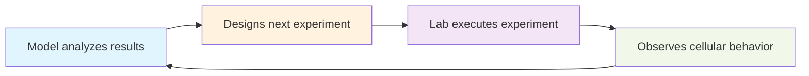

# Model: Machine Understanding of Cellular Life Discovery System

**Model** is the core component in an active learning discovery system that coordinates the planning for preparing new samples based on experimental data from previous experiments. It iteratively generates and validates hypotheses, and generates sample_spec that acts as inputs for other automated processes, such as sample generation and imaging systems.

## System Overview

The Model operates within a closed-loop experimental framework where it analyzes experimental results, formulates testable hypotheses, and generates detailed experimental specifications. Unlike traditional machine learning models that perform pattern recognition on static datasets, Model actively participates in the experimental design process by generating structured experiment specifications and incorporating feedback from experimental outcomes.

## Active Learning Loop Architecture

The Model operates through a continuous feedback loop with laboratory automation systems:



### Example Experimental Cycle

The Model processes experimental data and generates hypotheses for subsequent testing. In this example, the Model analyzes cellular response patterns and designs a follow-up experiment:

**Generated Sample_Spec**:
```json
{
  "cell_line": "HeLa",
  "passage_number": 12,
  "treatments": [{
    "name": "doxorubicin",
    "concentration": 1,
    "units": "µM",
    "duration": 6,
    "time_units": "hours"
  }],
  "imaging_parameters": {
    "channels": ["DAPI", "p53_Alexa488"],
    "time_lapse": {"interval": 300, "duration": 14400}
  }
}
```

The experimental data from this specification is collected and fed back into the Model for analysis. Based on the observed cellular responses, the Model generates updated hypotheses and produces new sample specifications for subsequent experiments. This process continues iteratively, with each cycle informed by the accumulated experimental evidence.

## Technical Architecture

### Multi-Head Neural Network
The Model implements a multi-head architecture with six specialized components:

- **Proposal Generation**: Generates testable hypotheses based on current experimental evidence
- **Methodology Planning**: Designs experimental protocols and optimizes resource allocation  
- **Falsification**: Creates adversarial experiments to test the robustness of established findings
- **Multi-Scale Integration**: Integrates phenomena across molecular, cellular, and population levels
- **Conceptual Framework**: Maintains theoretical coherence across discoveries
- **Context Management**: Maps the applicability boundaries of experimental findings

### Validation Framework
The Model implements systematic validation through falsification testing, where established findings are challenged with specifically designed adversarial experiments. Only results that survive these systematic attempts at refutation are incorporated into the knowledge base.

### Context-Dependent Knowledge Representation
The system maintains context-dependent knowledge structures, tracking not only experimental findings but also the specific conditions under which each finding applies. This includes mapping parameter spaces and identifying boundary conditions where relationships break down.

## Scientific Methodology

### Discovery Validation
- **Multi-Level Testing**: Validates findings across molecular, cellular, and population scales
- **Context Mapping**: Systematically explores the boundaries where discoveries hold true
- **Reproducibility**: Ensures discoveries are consistent across independent experiments
- **Falsification Resistance**: Only accepts discoveries that survive attempts to disprove them

### Output Formats
Model communicates discoveries through:
- **Natural language** explanations for human researchers
- **Mathematical models** with defined parameters and uncertainty bounds
- **Visual representations** showing relationships and processes
- **Structured protocols** for experimental replication

## Current Implementation Status

### ✅ Completed
- **Sample_Spec Schema**: Complete specification for experimental conditions ([sample_spec.md](sample_spec.md))
- **Conceptual Architecture**: Detailed system requirements and design
- **Data Structures**: JSON schemas for experiment specification and results

### 🚧 In Development
- **Model Architecture**: Multi-head neural network implementation
- **Laboratory Integration**: Interfaces for automated equipment control
- **Discovery Engine**: Core algorithms for hypothesis generation and testing

### 🔮 Future Development
- **Multi-Organism Systems**: Extend to tissue and organ-level phenomena
- **Temporal Dynamics**: Study evolutionary processes and biological rhythms
- **Cross-Disciplinary Integration**: Connect with computational chemistry and systems biology

## System Capabilities

The Model addresses several limitations in current experimental biology workflows:

1. **Automated hypothesis generation** based on comprehensive analysis of experimental data
2. **Experimental optimization** through systematic parameter exploration
3. **Context-dependent discovery** via systematic boundary condition testing
4. **Continuous experimentation** without manual intervention between experimental cycles

The system is designed to operate continuously, generating new experimental hypotheses and sample specifications based on accumulated experimental evidence.

## Technical Specifications

### Laboratory Equipment Integration
- Automated liquid handling systems
- High-content imaging and microscopy
- Robotic sample manipulation
- Specialized analytical instruments (qPCR, flow cytometry, mass spectrometry)

### Data Management
- Multi-modal experimental data handling
- Complete experimental provenance tracking
- Long-term discovery history storage
- Collaborative data sharing capabilities

### Performance Metrics
- **Novelty**: Discovery of previously unknown phenomena
- **Reproducibility**: Consistency across independent validations
- **Generalizability**: Applicability across different contexts
- **Scientific Impact**: Advancement of biological understanding

### Ethical Framework
- Operates within established research ethics guidelines
- Minimizes use of experimental resources
- Considers long-term implications of discoveries
- Maintains human oversight and collaboration capabilities

---

The Model system implements an active learning approach to biological discovery, combining computational analysis with automated experimental design. The system generates structured experimental specifications (sample_spec) that serve as inputs to automated laboratory systems, creating a closed-loop discovery pipeline for cellular biology research.

*Current implementation status: The sample specification schema and core architectural design are complete. Integration with laboratory automation systems and the multi-head neural network implementation are in development.*